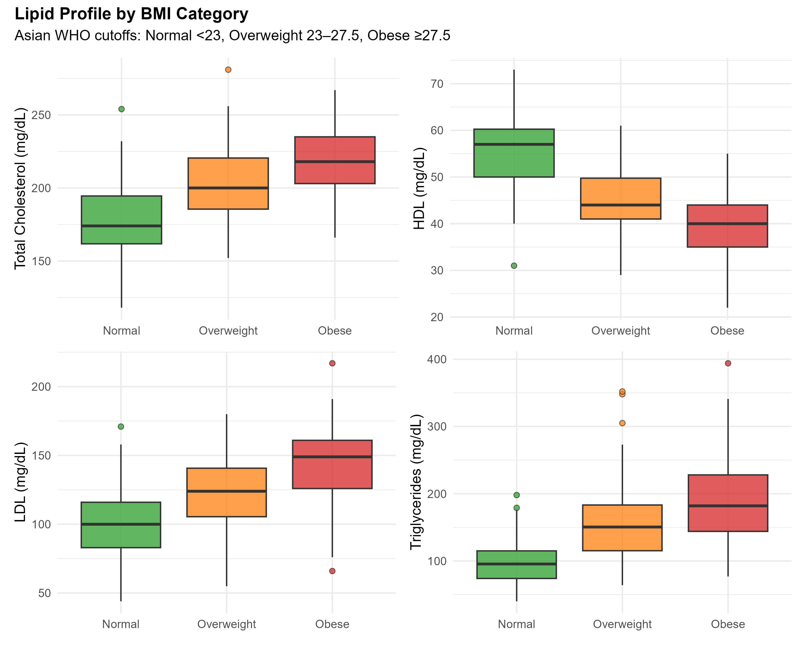
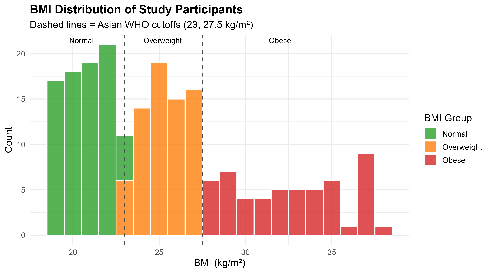
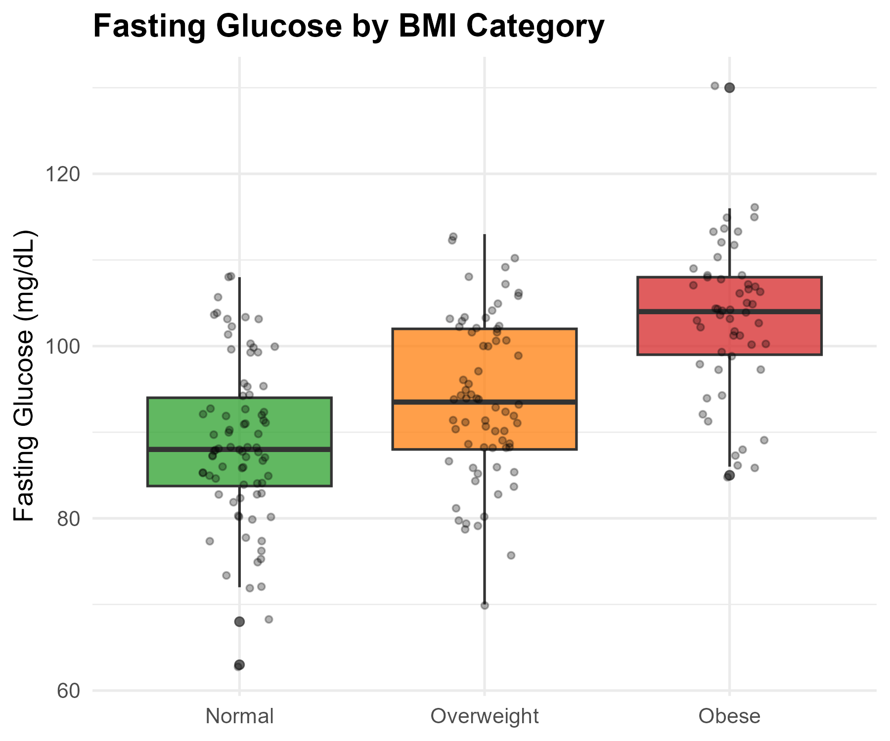
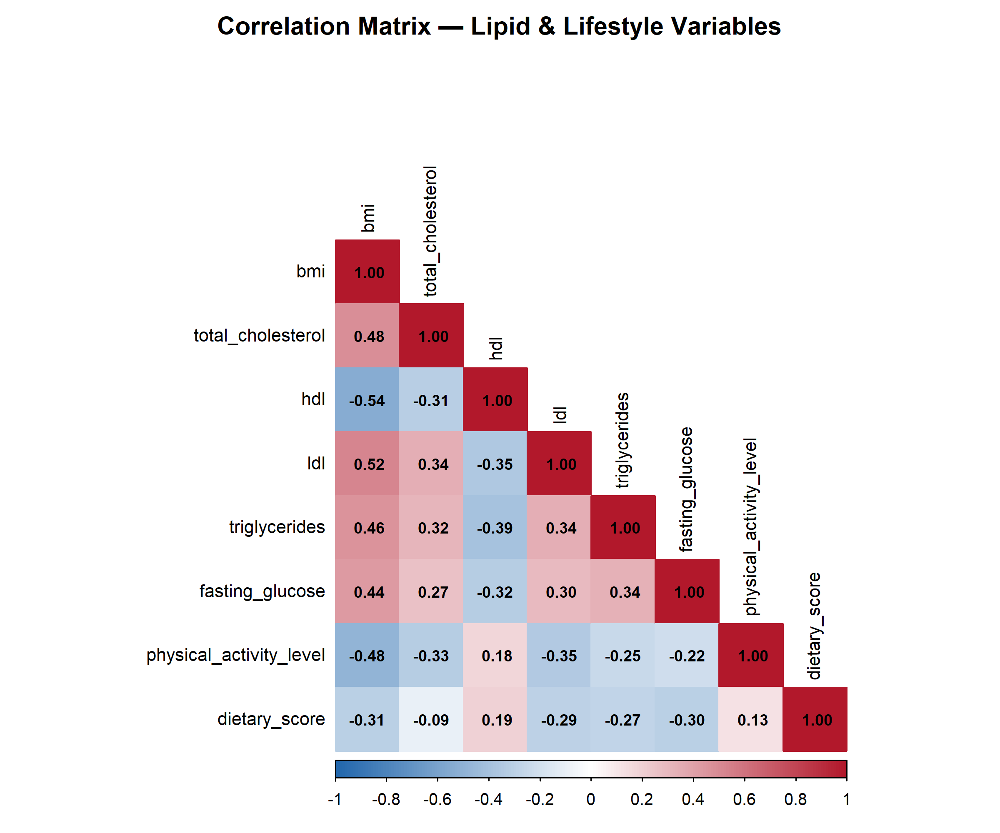

```{r setup, include=FALSE}
knitr::opts_knit$set(root.dir = here::here())
if (!require("tidyverse"))  install.packages("tidyverse",  repos = "https://cran.r-project.org")
if (!require("knitr"))      install.packages("knitr",      repos = "https://cran.r-project.org")
if (!require("kableExtra")) install.packages("kableExtra",  repos = "https://cran.r-project.org")
if (!require("effectsize")) install.packages("effectsize", repos = "https://cran.r-project.org")
if (!require("broom"))      install.packages("broom",      repos = "https://cran.r-project.org")
if (!require("corrplot"))   install.packages("corrplot",   repos = "https://cran.r-project.org")
if (!require("patchwork"))  install.packages("patchwork",  repos = "https://cran.r-project.org")
if (!require("RColorBrewer")) install.packages("RColorBrewer", repos = "https://cran.r-project.org")
if (!require("here"))       install.packages("here",       repos = "https://cran.r-project.org")
library(tidyverse); library(knitr); library(kableExtra)
library(effectsize); library(broom); library(corrplot)
library(patchwork); library(RColorBrewer)
```

## Abstract

**Background:** Dyslipidemia among young adults, particularly in Asian populations, is an emerging public health concern closely linked to rising obesity rates. This study examines lipid profile differences across BMI categories among medical students using Asian-specific WHO cutoffs.

**Methods:** A cross-sectional analysis was conducted on 203 medical students classified into Normal (BMI < 23), Overweight (BMI 23--27.5), and Obese (BMI $\geq$ 27.5) groups. Lipid profiles, fasting glucose, and lifestyle factors were compared using one-way ANOVA, chi-square tests, and Pearson correlations.

**Results:** Significant differences were observed across all lipid parameters (p < 0.001). Obese students exhibited higher total cholesterol, LDL, triglycerides, and fasting glucose, with lower HDL compared to normal-weight peers. Physical activity and dietary scores were inversely associated with BMI.

**Conclusion:** BMI category is strongly associated with adverse lipid profiles in medical students. Early screening and lifestyle interventions targeting this population are warranted.

---

## Background

Cardiovascular disease (CVD) remains the leading cause of mortality worldwide. Dyslipidemia---characterized by elevated total cholesterol, LDL, triglycerides, and reduced HDL---is a well-established modifiable risk factor. Among young adults, increasing BMI is consistently associated with unfavorable lipid profiles, yet most studies use Western BMI cutoffs that may underestimate risk in Asian populations.

The World Health Organization (WHO) recommends lower BMI thresholds for Asian populations: **Normal < 23 kg/m^2^**, **Overweight 23--27.5 kg/m^2^**, and **Obese $\geq$ 27.5 kg/m^2^**. This analysis applies these cutoffs to examine lipid profile patterns among medical students.

### Study Objectives

1. Compare lipid profiles (TC, HDL, LDL, TG) and fasting glucose across three BMI categories
2. Assess the association between BMI, lifestyle factors, and metabolic markers
3. Identify correlations among lipid parameters and behavioral variables

---

## Methods

### Study Design & Participants

This cross-sectional study includes **203 medical students** stratified into three groups based on Asian WHO BMI cutoffs:

- **Normal** (BMI < 23): n = 80
- **Overweight** (BMI 23--27.5): n = 70
- **Obese** (BMI $\geq$ 27.5): n = 53

### Data Generation

```{r simulate}
source("simulate_data.R")
```

### Variables Measured

| Variable | Type | Unit/Scale |
|---|---|---|
| Age | Continuous | Years |
| Sex | Categorical | Male / Female |
| BMI | Continuous | kg/m^2^ |
| Total Cholesterol | Continuous | mg/dL |
| HDL Cholesterol | Continuous | mg/dL |
| LDL Cholesterol | Continuous | mg/dL |
| Triglycerides | Continuous | mg/dL |
| Fasting Glucose | Continuous | mg/dL |
| Physical Activity Level | Ordinal | 1 (sedentary) -- 5 (very active) |
| Dietary Score | Continuous | 1 (poor) -- 10 (excellent) |

### Statistical Analysis

- **Descriptive statistics:** Mean $\pm$ SD for continuous variables; frequencies for categorical variables
- **Chi-square test:** Sex and physical activity distribution across groups (Cramer's V for effect size)
- **One-way ANOVA:** Comparison of continuous variables across BMI groups ($\eta^2$ for effect size)
- **Pearson correlation:** Bivariate relationships among numeric variables
- Significance threshold: $\alpha$ = 0.05

```{r analysis}
source("analysis.R")
```

---

## Results

### Participant Characteristics

```{r desc-table}
desc_stats <- read_csv("outputs/descriptive_statistics.csv", show_col_types = FALSE)

desc_stats %>%
  mutate(summary = paste0(mean, " ± ", sd)) %>%
  select(variable, bmi_group, summary) %>%
  pivot_wider(names_from = bmi_group, values_from = summary) %>%
  kable(
    caption = "Table 1. Descriptive Statistics by BMI Group (Mean ± SD)",
    col.names = c("Variable", "Normal", "Overweight", "Obese"),
    align = "lccc"
  ) %>%
  kable_styling(bootstrap_options = c("striped", "hover", "condensed"),
                full_width = FALSE, position = "center")
```

### Chi-Square Tests

#### Sex Distribution

```{r chi-sex}
chi_sex <- read_csv("outputs/chi_square_sex.csv", show_col_types = FALSE)

chi_sex %>%
  kable(
    caption = "Table 2. Chi-Square Test: Sex Distribution Across BMI Groups",
    align = "lcccc"
  ) %>%
  kable_styling(bootstrap_options = c("striped", "condensed"),
                full_width = FALSE, position = "center")
```

The chi-square test for sex distribution across BMI groups yielded $\chi^2$(`r chi_sex$df`) = `r chi_sex$statistic`, *p* = `r chi_sex$p_value`, Cramer's V = `r chi_sex$cramers_v`, indicating `r ifelse(chi_sex$p_value < 0.05, "a statistically significant", "no statistically significant")` association between sex and BMI category.

#### Physical Activity Level

```{r chi-pa}
chi_pa <- read_csv("outputs/chi_square_physical_activity.csv", show_col_types = FALSE)

chi_pa %>%
  kable(
    caption = "Table 3. Chi-Square Test: Physical Activity Level Across BMI Groups",
    align = "lcccc"
  ) %>%
  kable_styling(bootstrap_options = c("striped", "condensed"),
                full_width = FALSE, position = "center")
```

Physical activity distribution differed significantly across groups: $\chi^2$(`r chi_pa$df`) = `r chi_pa$statistic`, *p* = `r chi_pa$p_value`, Cramer's V = `r chi_pa$cramers_v`.

### One-Way ANOVA Results

```{r anova-table}
anova_results <- read_csv("outputs/anova_results.csv", show_col_types = FALSE)

anova_results %>%
  kable(
    caption = "Table 4. One-Way ANOVA: Continuous Variables Across BMI Groups",
    col.names = c("Variable", "F", "df1", "df2", "p-value", "η²", "Sig."),
    align = "lcccccc",
    digits = c(0, 3, 0, 0, 4, 4, 0)
  ) %>%
  kable_styling(bootstrap_options = c("striped", "hover", "condensed"),
                full_width = FALSE, position = "center") %>%
  footnote(general = "Significance: *** p<0.001, ** p<0.01, * p<0.05, ns = not significant")
```

```{r anova-interpretation, results='asis'}
sig_vars <- anova_results %>% filter(significance != "ns")
ns_vars  <- anova_results %>% filter(significance == "ns")

if (nrow(sig_vars) > 0) {
  cat(sprintf("\nSignificant group differences were found for **%s** (all p < 0.05).\n",
              paste(sig_vars$variable, collapse = ", ")))
}
if (nrow(ns_vars) > 0) {
  cat(sprintf("\nNo significant differences were found for **%s**.\n",
              paste(ns_vars$variable, collapse = ", ")))
}

# Highlight largest effect sizes
top_effect <- sig_vars %>% arrange(desc(eta_squared)) %>% slice(1)
if (nrow(top_effect) > 0) {
  cat(sprintf("\nThe largest effect size was observed for **%s** (η² = %.4f, F(%d, %d) = %.2f, p = %s), indicating a %s effect.\n",
              top_effect$variable, top_effect$eta_squared,
              top_effect$df1, top_effect$df2, top_effect$f_statistic,
              format(top_effect$p_value, scientific = TRUE),
              ifelse(top_effect$eta_squared >= 0.14, "large",
                     ifelse(top_effect$eta_squared >= 0.06, "medium", "small"))))
}
```

### Lipid Profile Visualization

```{r lipid-boxplots, fig.cap="Figure 1. Lipid profile distributions across BMI categories. Boxes represent IQR; whiskers extend to 1.5×IQR."}
source("visualize.R")

```

### BMI Distribution

```{r bmi-dist, fig.cap="Figure 2. BMI distribution of study participants with Asian WHO cutoff lines."}

```

### Fasting Glucose

```{r glucose-plot, fig.cap="Figure 3. Fasting glucose levels by BMI category with individual data points."}

```

### Correlation Analysis

```{r cor-table}
cor_matrix <- read_csv("outputs/correlation_matrix.csv", show_col_types = FALSE)

cor_matrix %>%
  kable(
    caption = "Table 5. Pearson Correlation Matrix",
    digits = 3,
    align = "lcccccccc"
  ) %>%
  kable_styling(bootstrap_options = c("striped", "hover", "condensed"),
                full_width = FALSE, position = "center", font_size = 12)
```

```{r cor-heatmap, fig.cap="Figure 4. Correlation heatmap of lipid and lifestyle variables."}

```

---

## Discussion

### Key Findings

This cross-sectional analysis reveals a clear, dose-response relationship between BMI category and lipid profile abnormalities among medical students:

1. **Total cholesterol and LDL** increased progressively from the Normal to Obese group, consistent with established literature linking adiposity to hepatic cholesterol synthesis and reduced LDL receptor activity.

2. **HDL cholesterol** was inversely associated with BMI, with the Obese group demonstrating the lowest mean HDL levels. This is clinically significant as low HDL is an independent risk factor for cardiovascular disease.

3. **Triglycerides** showed the most pronounced group differences, consistent with the known role of visceral adiposity in driving hepatic triglyceride production and impaired lipoprotein lipase activity.

4. **Fasting glucose** levels were elevated in higher BMI groups, suggesting early metabolic dysregulation that may precede frank insulin resistance.

5. **Lifestyle factors** (physical activity and dietary quality) were significantly lower in the Obese group, pointing to modifiable targets for intervention.

### Clinical Implications

These findings are particularly relevant for Asian populations, where metabolic risk manifests at lower BMI thresholds than in Western populations. The use of Asian-specific WHO cutoffs in this study likely provides a more accurate risk stratification for this demographic.

Medical students, despite their health knowledge, are not immune to lifestyle-related metabolic risk. Targeted wellness programs within medical education could serve both individual health and professional development goals.

### Limitations

- Cross-sectional design precludes causal inference
- Synthetic data used for demonstration; real clinical data would strengthen findings
- Self-reported lifestyle variables may be subject to reporting bias
- Single fasting glucose measurement does not capture full glycemic status

### Future Directions

- Longitudinal follow-up to assess lipid profile trajectories
- Inclusion of waist circumference and body fat percentage for better adiposity characterization
- Biomarker panels (HbA1c, insulin, hs-CRP) for comprehensive metabolic profiling

---

## References

1. World Health Organization. (2004). Appropriate body-mass index for Asian populations and its implications for policy and intervention strategies. *The Lancet*, 363(9403), 157--163.
2. Nelson, R. H. (2013). Hyperlipidemia as a risk factor for cardiovascular disease. *Primary Care*, 40(1), 195--211.
3. Misra, A., & Khurana, L. (2008). Obesity and the metabolic syndrome in developing countries. *The Journal of Clinical Endocrinology & Metabolism*, 93(11), s9--s30.
4. Cohen, J. (1988). *Statistical Power Analysis for the Behavioral Sciences* (2nd ed.). Lawrence Erlbaum Associates.

---

*Analysis conducted using R `r R.version.string` with tidyverse, effectsize, corrplot, and patchwork packages. Report generated with Quarto.*
